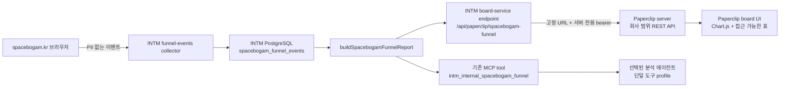

# 공간보감 퍼널 분석 — Paperclip 구현 계획

## 1. 목표

`spacebogam.kr`의 UTM·행동 이벤트를 이용해 현재 퍼널 상태, 가장 큰 병목, 데이터 신뢰도, 다음 개선 액션을 Paperclip 안에서 한눈에 확인할 수 있는 회사 범위 분석 페이지를 만든다.

완료 상태는 다음을 모두 만족해야 한다.

1. Paperclip 사이드바의 `회사` 영역에 `퍼널 분석` 메뉴가 보인다.
2. 회사 범위 경로 `/:companyPrefix/analytics/funnel`에서 7일·28일·90일 분석을 볼 수 있다.
3. Chart.js 기반 네 가지 핵심 시각화와 접근 가능한 표가 동일한 집계 응답을 사용한다.
4. 표본·신선도·이벤트 순서가 충분할 때만 병목과 액션을 제안한다.
5. Paperclip 보드 사용자는 회사 범위 REST API만 사용하고, 선택된 분석 에이전트는 기존 INTM MCP 도구만 최소 권한으로 사용한다.
6. Paperclip 실데이터 경로와 에이전트 경로가 검증된 뒤, INTM에 잘못 노출된 사이드바·페이지·보드용 API만 제거한다.
7. 자동 테스트의 RED→GREEN 로그, 실제 브라우저 화면, 실제 HTTP 응답, 임시 프로세스 정리 영수증이 남는다.

## 2. 범위와 비범위

### 포함

- Paperclip 회사 범위 페이지, 사이드바, 라우팅, 한국어 메뉴명
- Chart.js v4 + `react-chartjs-2` v5 시각화
- Paperclip 공유 타입·Zod 검증기·보드 전용 REST API
- INTM의 기존 집계 리포트 확장과 Paperclip 서버 전용 업스트림 엔드포인트
- 데이터 품질 판정, 병목 계산, 액션 추천 규칙
- 기존 `intm_internal_spacebogam_funnel` MCP 도구의 최소 권한 프로필 연결
- 접근성, 반응형, 상태별 Storybook, Playwright 실브라우저 검증
- 잘못 만든 INTM 운영자 UI의 검증 후 제거

### 제외

- 원시 이벤트 행, IP, 연락처, 자유 형식 페이로드를 Paperclip이나 에이전트에 노출
- 새 데이터웨어하우스·BI 도구·분석 SaaS 도입
- 에이전트가 Paperclip 보드 REST API를 대신 호출하거나 보드가 에이전트 ID를 위조하는 구조
- Chart.js 외 별도 차트·데이터레이블 플러그인
- 첫 버전의 임의 날짜 선택, UTM/device 교차 필터, 코호트·어트리뷰션 모델링
- 근거가 부족한 AI 자유서술 진단
- INTM 이벤트 수집기와 저장 테이블 제거

## 3. 확정 아키텍처



핵심 경계는 다음과 같다.

- 단일 계산원은 INTM의 `buildSpacebogamFunnelReport`다. 보드와 에이전트가 별도 공식을 갖지 않는다.
- Paperclip 브라우저는 INTM URL과 토큰을 받지 않는다.
- Paperclip 보드 API는 `assertBoard(req)`와 `assertCompanyAccess(req, companyId)`를 모두 통과해야 한다.
- 에이전트는 기존 MCP 연결과 도구 프로필을 사용한다. Paperclip REST API는 보드 전용이다.
- INTM 신규 업스트림은 설정된 한 회사·한 리포트만 반환한다. 요청자가 업스트림 URL이나 SQL을 지정할 수 없다.

## 4. 데이터 계약

### 4.1 퍼널 단계와 단위

모든 단계는 요청 기간 내 고유 `session_id` 수다. UI에서 `사용자`가 아닌 `세션`으로 표시한다.

| 단계 키 | 표시명 | 기준 이벤트 |
|---|---|---|
| `visit` | 방문 | `page_view` |
| `engaged` | 10초 이상 참여 | `engaged_session` |
| `consultation` | 상담 CTA 클릭 | `consultation_click` |
| `form_start` | 상담 작성 시작 | `lead_form_start` |
| `lead` | 상담 제출 완료 | `lead_submit_success` |

각 단계에는 다음 값을 포함한다.

- `count`: 해당 단계 고유 세션 수
- `previousCount`: 직전 단계 수, 첫 단계는 `null`
- `conversionFromPrevious`: 직전 단계 대비 비율, 분모 0이면 `null`
- `dropOffCount`: `previousCount - count`, 첫 단계는 `null`
- `dropOffRate`: 직전 단계 대비 손실률, 분모 0이면 `null`

음수 손실을 0으로 숨기지 않는다. 단계 수가 역전되면 `isMonotonic=false`로 보고 액션 추천을 중단한다.

### 4.2 응답 스키마

INTM 집계 리포트와 Paperclip 공유 타입은 아래 개념을 동일하게 표현한다.

```ts
type SpacebogamFunnelReport = {
  schemaVersion: 1;
  timezone: "Asia/Seoul";
  rangeDays: 7 | 28 | 90;
  generatedAt: string;
  dataThrough: string | null;
  collectionStartedAt: string | null;
  counts: {
    visits: number;
    engagedVisits: number;
    consultationClicks: number;
    formStarts: number;
    submittedLeads: number;
  };
  stages: Array<{
    key: "visit" | "engaged" | "consultation" | "form_start" | "lead";
    label: string;
    count: number;
    previousCount: number | null;
    conversionFromPrevious: number | null;
    dropOffCount: number | null;
    dropOffRate: number | null;
  }>;
  daily: Array<{
    date: string;
    visits: number;
    submittedLeads: number;
    visitToLeadRate: number | null;
  }>;
  campaigns: Array<{
    source: string;
    medium: string;
    campaign: string;
    visits: number;
    submittedLeads: number;
    visitToLeadRate: number | null;
    sampleStatus: "usable" | "insufficient";
  }>;
  quality: {
    status: "empty" | "collecting" | "ready" | "stale" | "invalid_sequence";
    sampleSessions: number;
    minimumReadySessions: 50;
    newestEventAt: string | null;
    freshnessHours: number | null;
    utmTaggedVisitRate: number | null;
    missingDataDays: string[];
    isMonotonic: boolean;
    warnings: string[];
  };
  bottleneck: {
    fromStage: string;
    toStage: string;
    lostSessions: number;
    lossRate: number;
  } | null;
  recommendations: Array<{
    code: string;
    title: string;
    reason: string;
    action: string;
    confidence: "measurement_only" | "directional";
  }>;
  legacyBaseline: unknown;
};
```

계약 규칙:

- `daily`는 요청 시점의 `Asia/Seoul` 오늘을 마지막 날로 삼아 정확히 7·28·90개의 달력 날짜를 반환한다.
- 이벤트가 없는 날짜는 0으로 채운다.
- `dataThrough`는 실제 최신 이벤트 시각이다. 일별 배열 끝을 `dataThrough`로 줄이지 않아 데이터 지연을 숨기지 않는다.
- `missingDataDays`는 `collectionStartedAt` 이후 오늘 이전까지 `page_view`가 0인 날짜다. UI에서는 확정 장애가 아닌 `수집 공백 가능성`으로 표현한다.
- UTM 태그 방문은 `utm_source` 또는 `utm_campaign`이 존재하는 방문 세션이다.
- 현재 저장소에서 신뢰성 있게 계산할 수 없는 중복 이벤트율은 추가하지 않는다. 고유 `event_id` 충돌이 저장 전에 제거되므로 사후 집계로 중복 시도 횟수를 복원할 수 없다.
- `legacyBaseline`은 기존 GA4 참고값 보존용이다. 현재 1차 데이터와 같은 차트에 겹치지 않고 접힌 참고 영역에만 둔다.

### 4.3 품질 판정

우선순위가 높은 상태 하나를 선택한다.

1. `empty`: 방문 세션 0
2. `invalid_sequence`: 단계 수가 직전 단계보다 큰 구간 존재
3. `stale`: 최신 이벤트가 없거나 현재보다 36시간 초과
4. `collecting`: 방문 세션 1~49
5. `ready`: 방문 세션 50 이상, 최신성·단계 순서 정상

추가 경고:

- UTM 태그 방문률이 60% 미만이면 캠페인 해석에 `UTM 부족` 경고
- 요청 기간 중 수집 공백 가능 날짜 존재
- 캠페인별 방문 30 미만은 `표본 부족`
- `collectionStartedAt`이 요청 기간 시작 이후면 전체 기간 비교가 불완전함

### 4.4 병목과 액션 규칙

병목은 자유서술 모델이 아니라 결정적 규칙으로 계산한다.

- 방문 세션 50 미만이면 병목 순위를 만들지 않고 `측정 계속`만 제안한다.
- 직전 단계 분모가 50 이상인 구간만 후보로 삼는다.
- 후보를 `lostSessions` 내림차순으로 정렬하고 동률이면 `lossRate` 내림차순으로 정한다.
- `stale` 또는 `invalid_sequence`이면 병목·행동 액션을 숨기고 수집/계측 액션만 표시한다.
- 캠페인은 방문 30 이상일 때만 전환 품질 순위를 붙인다. 그 미만도 표에는 보이되 판단에서는 제외한다.

단계별 기본 액션:

| 병목 | 제안 액션 |
|---|---|
| 방문→참여 | 첫 화면 메시지와 UTM 광고 약속의 일치, 로딩·모바일 첫 화면을 점검 |
| 참여→상담 CTA | 포트폴리오 근처 CTA 위치·문구·사회적 증거를 한 가지씩 실험 |
| 상담 CTA→작성 시작 | 폼 진입 경로, 모달/새 페이지 마찰, 필수 정보 안내를 점검 |
| 작성 시작→제출 | 필드 수·검증 오류·개인정보 신뢰 문구·제출 실패 이벤트를 점검 |

UI 액션 카드는 `어디서`, `얼마나`, `왜 지금 판단 가능한지`, `다음 한 가지 행동`을 함께 보여준다.

## 5. HTTP와 보안 계약

### 5.1 INTM board-service

신규 경로:

```text
GET /api/paperclip/spacebogam-funnel?rangeDays=28
Authorization: Bearer <PAPERCLIP_SPACEBOGAM_DASHBOARD_TOKEN>
X-Paperclip-Company-Id: <configured-company-id>
```

환경변수:

- `SPACEBOGAM_COMPANY_ID`
- 기존 `PAPERCLIP_INTM_PAPERCLIP_COMPANY_ID`
- 신규 `PAPERCLIP_SPACEBOGAM_DASHBOARD_TOKEN`

규칙:

- bearer 비교는 상수 시간 비교를 사용한다.
- 회사 헤더는 `PAPERCLIP_INTM_PAPERCLIP_COMPANY_ID`와 정확히 일치해야 한다.
- 집계 대상은 고정 `SPACEBOGAM_COMPANY_ID`다.
- `rangeDays`는 7·28·90만 허용하고 누락 시 28이다.
- 사용자 입력 URL, 임의 회사 ID, 원시 이벤트 조회를 받지 않는다.
- 설정 누락 503, 잘못된 토큰 401, 회사 불일치 403, 잘못된 기간 400을 반환한다.
- 인증 거부와 업스트림 실패는 비밀·헤더·원시 페이로드를 제외한 구조화 로그만 남긴다.
- 읽을 때마다 활동 DB 행을 적재하지 않는다. 에이전트 MCP 호출은 기존 감사 경로를 유지한다.

### 5.2 Paperclip board API

신규 경로:

```text
GET /api/companies/:companyId/analytics/spacebogam-funnel?rangeDays=28
```

환경변수:

- `SPACEBOGAM_FUNNEL_UPSTREAM_URL`
- `SPACEBOGAM_FUNNEL_UPSTREAM_TOKEN`
- `SPACEBOGAM_FUNNEL_PAPERCLIP_COMPANY_ID`

세 값이 모두 있을 때만 활성화한다.

규칙:

- `assertBoard(req)` 후 `assertCompanyAccess(req, companyId)`를 적용한다.
- URL의 회사와 `SPACEBOGAM_FUNNEL_PAPERCLIP_COMPANY_ID`가 다르면 존재를 숨기기 위해 404 `spacebogam_funnel_not_configured`.
- 설정 누락은 503 `spacebogam_funnel_disabled`.
- 기간 오류는 400 `invalid_range_days`.
- 업스트림 타임아웃은 504 `spacebogam_funnel_timeout`.
- 업스트림 인증 실패, 비정상 상태, Zod 스키마 실패는 502 `spacebogam_funnel_upstream_error`.
- 업스트림 URL은 환경변수의 고정 URL만 사용한다.
- 타임아웃 5초, redirect 비활성, 최대 응답 1 MiB를 적용한다.
- Zod 검증을 통과한 집계만 브라우저에 반환한다.
- 첫 버전은 서버 응답 캐시를 추가하지 않는다. UI 쿼리는 `staleTime: 60_000`, `refetchInterval: 300_000`으로 비용과 최신성을 균형 잡는다.

## 6. Paperclip 화면 설계

### 6.1 경로와 내비게이션

- 정식 경로: `/:companyPrefix/analytics/funnel`
- 비회사 경로 `/analytics/funnel`은 현재 선택 회사의 정식 경로로 리다이렉트
- `BOARD_ROUTE_ROOTS`에 `analytics` 추가
- 사이드바 `회사` 섹션에 `Funnel Analytics` 항목 추가
- 한국어 메뉴 사전에 `"Funnel Analytics": "퍼널 분석"` 추가
- 데스크톱·축소 사이드바·모바일 메뉴에서 동일하게 접근 가능해야 한다.

### 6.2 정보 계층

1. 페이지 헤더
   - `공간보감 퍼널 분석`
   - 7일·28일·90일 선택
   - 생성 시각, 최신 데이터 시각, 상태 배지
2. KPI 스트립
   - 방문 세션
   - 상담 제출
   - 방문→상담 제출 전환율
   - 데이터 신선도/상태
3. 최우선 병목·액션 카드
   - `ready`일 때만 행동 제안
   - 그 외에는 측정/수집 문제를 최우선으로 표시
4. 네 가지 Chart.js 시각화
5. 캠페인·단계 접근 가능 표
6. 데이터 품질·지표 정의
7. 접힌 `기존 GA4 참고값`

### 6.3 Chart.js 시각화

#### A. 단계 진행 — 가로 막대

- X: 세션 수
- Y: 방문→참여→상담 CTA→작성 시작→제출
- 막대 옆 HTML 요약에 단계 수, 직전 대비 전환, 손실 수를 표시
- 병목 단계에만 강조 토큰과 `가장 큰 병목` 텍스트를 함께 제공

#### B. 일별 흐름 — 혼합 막대·선

- 막대: 일별 방문 세션, 제출 세션
- 선: 방문→제출 전환율
- 이중 축은 단위를 명확히 표시한다.
- 28일 기본 화면에서 일별 변동과 최근 데이터 공백을 동시에 볼 수 있어야 한다.

#### C. UTM 캠페인 품질 — 버블/산점도

- X: 방문 세션
- Y: 방문→제출 전환율
- 버블 반지름: 제출 세션
- 그룹/범례: `utm_source`
- 점 라벨: `utm_campaign`, 혼잡 시 상위 표본만 직접 표시하고 나머지는 tooltip과 표에서 제공
- 방문 30 미만은 낮은 불투명도와 `표본 부족` 상태를 함께 표시
- UTM 태그율이 낮으면 차트 상단에 해석 제한 경고

#### D. 손실 Pareto — 혼합 막대·누적선

- 막대: 단계별 잃은 세션 수
- 선: 전체 손실 중 누적 비중
- 가장 많은 절대 손실이 어디에 집중되는지 보여준다.
- 손실이 음수이거나 품질 상태가 부적합하면 차트 대신 데이터 순서 경고를 표시한다.

네 차트는 같은 숫자를 장식적으로 반복하지 않는다. 각각 현재 규모, 시간 변화, 유입 품질, 손실 집중도를 담당한다.

### 6.4 Chart.js 구현 원칙

- 의존성은 `chart.js@^4`, `react-chartjs-2@^5`만 추가한다.
- `chart.js/auto`를 사용하지 않는다.
- `CategoryScale`, `LinearScale`, `BarController`, `LineController`, `BubbleController`, 필요한 elements, `Tooltip`, `Legend`만 등록한다.
- 데이터셋마다 안정적인 label과 `datasetIdKey`를 둔다.
- 차트 컨테이너는 `position: relative`, 명시적 높이, `maintainAspectRatio:false`를 사용한다.
- CSS `var(...)` 문자열을 Canvas에 직접 넘기지 않는다. `getComputedStyle`로 `--chart-1`~`--chart-5`와 상태 토큰을 해석한다.
- 값 직접 표기가 꼭 필요하면 로컬 `afterDatasetsDraw` 플러그인 하나만 작성한다. 외부 플러그인은 추가하지 않는다.
- `prefers-reduced-motion`이면 애니메이션을 끈다.
- E2E 스크린샷은 애니메이션을 끄고 고정 fixture를 사용한다.
- Canvas마다 의미 있는 `aria-label`을 두고, 동일 내용을 인접 HTML 표로 제공한다.
- 색만으로 상태를 구분하지 않고 텍스트, 아이콘, 패턴/선 스타일을 병행한다.

공식 구현 참고:

- [react-chartjs-2](https://react-chartjs-2.js.org/)
- [Chart.js selective registration](https://www.chartjs.org/docs/latest/getting-started/usage.html)
- [Responsive charts](https://www.chartjs.org/docs/latest/configuration/responsive.html)
- [Mixed charts](https://www.chartjs.org/docs/latest/charts/mixed.html)
- [Plugin hooks](https://www.chartjs.org/docs/latest/developers/plugins.html)
- [Canvas accessibility](https://www.chartjs.org/docs/latest/general/accessibility.html)

### 6.5 화면 상태

| 상태 | 화면 |
|---|---|
| loading | KPI·차트 크기를 유지하는 skeleton |
| empty | 수집 이벤트 0, 설치/유입 확인 안내, 병목 없음 |
| collecting | 표본 50 미만, 현황만 표시하고 행동 진단 보류 |
| ready | 네 차트, 병목, 한 가지 우선 액션 |
| stale | 마지막 데이터 시각과 수집 점검 액션, 진단 숨김 |
| invalid_sequence | 이벤트 순서 이상 경고, 단계별 수치 표, 진단 숨김 |
| disabled | Paperclip 서버 설정 필요 |
| not configured | 현재 회사에는 공간보감 퍼널이 연결되지 않음 |
| upstream error/timeout | 기존 데이터처럼 보이지 않는 명시적 재시도 상태 |

## 7. 에이전트 접근

기존 MCP 도구 `intm_internal_spacebogam_funnel`을 유지한다. 새 분석 서버나 범용 INTM 권한을 만들지 않는다.

구성 순서:

1. 현재 Paperclip 회사에 분석/마케팅 담당 에이전트가 있는지 확인한다.
2. 있으면 재사용하고, 없으면 읽기 전용 역할의 `공간보감 퍼널 분석` 에이전트를 생성한다.
3. 기존 INTM `remote_http` 도구 연결을 재사용하거나 해당 MCP URL로 하나만 만든다.
4. 연결의 도구 카탈로그를 새로고침한다.
5. `Spacebogam Funnel Read` 도구 프로필을 만들고 `intm_internal_spacebogam_funnel` 하나만 포함한다.
6. 선택한 에이전트에만 프로필을 연결한다.
7. 아래 두 경로로 유효 권한과 실제 호출을 검증한다.

```text
GET /api/companies/:companyId/tools/profiles/effective/agents/:agentId

POST /api/tool-connections/:connectionId/test-calls
{
  "agentId": "<agent-id>",
  "toolName": "intm_internal_spacebogam_funnel",
  "parameters": { "rangeDays": 28 }
}
```

합격 조건:

- 유효 도구 목록에 `intm_internal_spacebogam_funnel`만 존재한다.
- 28일 호출 응답이 보드와 같은 `schemaVersion`, `timezone`, 단계 수, 품질 상태를 가진다.
- 다른 INTM safe 도구 호출은 권한 거부된다.
- MCP 감사 로그에는 에이전트·도구·회사·결과가 남고 비밀값은 남지 않는다.

## 8. 파일별 구현 계획

### Wave 1 — INTM 리포트 계약과 진단 규칙

수정:

- `/Users/changseok/Documents/.codex-worktrees/intm-spacebogam-funnel-20260725/src/lib/spacebogam-funnel/contracts.ts`
  - `schemaVersion`, `timezone`, `dataThrough`, `daily`, 확장 stage, `quality`, 결정적 `bottleneck` 추가
- `/Users/changseok/Documents/.codex-worktrees/intm-spacebogam-funnel-20260725/src/lib/spacebogam-funnel/repository.ts`
  - KST 일별 zero-fill 집계, 최신 이벤트, UTM 태그율, 캠페인 표본 필드 반환
- `/Users/changseok/Documents/.codex-worktrees/intm-spacebogam-funnel-20260725/src/lib/spacebogam-funnel/analytics.ts`
  - 품질 상태·병목 순위·단계별 액션 규칙 구현
- `/Users/changseok/Documents/.codex-worktrees/intm-spacebogam-funnel-20260725/src/lib/spacebogam-funnel/service.ts`
  - 확장 데이터를 하나의 보고서로 조합
- `/Users/changseok/Documents/.codex-worktrees/intm-spacebogam-funnel-20260725/tests/spacebogam-funnel-analytics.spec.ts`
  - sparse, stale, invalid sequence, 28일 zero-fill, Pareto 병목 규칙의 RED→GREEN 테스트

보존:

- `src/app/api/marketing/funnel-events/route.ts`
- `migrations/20260725_spacebogam_funnel_events.sql`
- 기존 수집 이벤트 이름과 PII 금지 정책

완료 게이트:

- 같은 fixture에서 리포트 빌더와 MCP 도구가 같은 핵심 결과를 반환한다.
- 50/30/36시간 임계값과 KST 날짜 규칙이 단위 테스트에 고정된다.

### Wave 2 — INTM Paperclip 서버 전용 업스트림

추가:

- `/Users/changseok/Documents/.codex-worktrees/intm-spacebogam-funnel-20260725/src/app/api/paperclip/spacebogam-funnel/route.ts`
- `/Users/changseok/Documents/.codex-worktrees/intm-spacebogam-funnel-20260725/tests/paperclip-spacebogam-funnel-route.spec.ts`

수정:

- INTM 환경변수 예제/운영 문서의 서버 전용 토큰 항목

테스트:

- 정상 28일 응답
- 7·28·90 외 400
- 토큰 누락/불일치
- 회사 헤더 불일치
- 응답에 원시 이벤트·연락처·토큰이 없는지

완료 게이트:

- localhost HTTP로 실제 엔드포인트를 호출하고 Zod/fixture 예상 계약과 일치한다.
- MCP 구현은 계속 같은 `buildSpacebogamFunnelReport`를 호출한다.

### Wave 3 — Paperclip 공유 계약과 보드 API

추가:

- `packages/shared/src/types/spacebogam-funnel.ts`
- `packages/shared/src/validators/spacebogam-funnel.ts`
- `packages/shared/src/validators/spacebogam-funnel.test.ts`
- `server/src/routes/spacebogam-funnel.ts`
- `server/src/__tests__/spacebogam-funnel-routes.test.ts`

수정:

- `packages/shared/src/types/index.ts`
- `packages/shared/src/validators/index.ts`
- `packages/shared/src/index.ts`
- `packages/shared/src/api.ts`
- `server/src/app.ts`
- `server/src/routes/openapi.ts`
- Paperclip 환경변수 예제/운영 문서

구현:

- 공유 Zod 스키마를 HTTP 신뢰 경계에서 사용
- board/company 권한, 고정 회사 매핑, 오류 코드, 5초 타임아웃, redirect 금지, 1 MiB 한도
- OpenAPI에 경로·응답·오류 추가

완료 게이트:

- 회사 A는 자신의 설정에서만 200, 회사 B는 404
- agent bearer는 board API에서 거부
- 업스트림 비밀은 응답·로그·OpenAPI 예제에 포함되지 않음

### Wave 4 — Paperclip Chart.js 화면

의존성:

- `ui/package.json`: `chart.js@^4`, `react-chartjs-2@^5`
- 저장소 정책에 따라 로컬 `pnpm-lock.yaml` 변경은 커밋하지 않는다.
- 의존성 추가 전후 production bundle 크기를 기록하고, 신규 page chunk가 비정상적으로 커지면 route-level lazy import를 적용한다.

추가:

- `ui/src/api/spacebogam-funnel.ts`
- `ui/src/pages/SpacebogamFunnelAnalytics.tsx`
- `ui/src/pages/SpacebogamFunnelAnalytics.test.tsx`
- `ui/src/components/spacebogam-funnel/SpacebogamFunnelCharts.tsx`
- `ui/src/components/spacebogam-funnel/SpacebogamFunnelCharts.test.tsx`
- `ui/src/components/spacebogam-funnel/SpacebogamFunnelTables.tsx`
- `ui/src/components/spacebogam-funnel/chartTheme.ts`
- `ui/storybook/stories/spacebogam-funnel.stories.tsx`

수정:

- `ui/src/App.tsx`
- `ui/src/components/Sidebar.tsx`
- `ui/src/components/Sidebar.test.tsx`
- `ui/src/lib/company-routes.ts`
- `ui/src/i18n/korean-menu.ts`

Storybook fixture:

- `ready`
- `collecting`
- `stale`
- `invalid_sequence`
- `disabled/error`

완료 게이트:

- 네 개 실제 `<canvas>`가 렌더링된다.
- 각 Canvas 인접 표가 동일한 수치를 제공한다.
- 회사 전환 시 query key와 URL이 회사별로 바뀌며 이전 회사 데이터가 남지 않는다.
- 모바일 폭에서 가로 스크롤 없이 카드와 차트가 읽힌다.

### Wave 5 — Paperclip 브라우저·HTTP·에이전트 검증

추가:

- `tests/e2e/spacebogam-funnel.spec.ts`

검증 방식:

- 시각 회귀는 `page.route`로 고정 fixture를 주입해 결정적으로 검증한다.
- 별도 수동 실데이터 QA에서는 실제 INTM 업스트림과 실제 Paperclip 서버를 연결한다.
- 구현 반복마다 저장소 지침의 `visual-verdict`를 실행하고 결과 JSON을 `.omx/state/.../ralph-progress.json`에 남긴다.
- `pnpm dev:list` 출력은 증거로 인정하지 않는다. `/api/health`의 200, `lsof` listener, 브라우저 로드가 모두 확인되어야 한다.

에이전트:

- 유효 도구 프로필 조회
- 허용 도구 실제 test-call
- 다른 INTM 도구 거부
- 보드와 MCP 핵심 집계 비교

완료 게이트:

- 실제 브라우저 스크린샷, 브라우저 console error 0, failed network request 0
- 실데이터 28일 API 200과 페이지 최신 시각 일치
- 토큰 값이 브라우저 network/HTML/로그에 없음

### Wave 6 — INTM 잘못 노출된 UI 제거

Paperclip과 에이전트 검증이 모두 GREEN인 뒤에만 실행한다.

삭제:

- `/Users/changseok/Documents/.codex-worktrees/intm-spacebogam-funnel-20260725/src/app/newportal/marketing/funnel/page.tsx`
- `/Users/changseok/Documents/.codex-worktrees/intm-spacebogam-funnel-20260725/src/app/newportal/marketing/funnel/spacebogam-funnel.module.css`
- `/Users/changseok/Documents/.codex-worktrees/intm-spacebogam-funnel-20260725/src/app/api/newportal/marketing/funnel/route.ts`

수정:

- `/Users/changseok/Documents/.codex-worktrees/intm-spacebogam-funnel-20260725/src/app/newportal/NewPortalSidebar.tsx`
  - `퍼널 분석` 링크 제거
- `/Users/changseok/Documents/.codex-worktrees/intm-spacebogam-funnel-20260725/tests/newportal-marketing-menu.spec.ts`
  - 잘못된 링크가 없고 기존 마케팅 메뉴는 유지되는 회귀 테스트로 변경

반드시 보존:

- 이벤트 collector와 migration
- `src/lib/spacebogam-funnel/*`
- 기존 MCP route/tool
- 신규 `/api/paperclip/spacebogam-funnel`

완료 게이트:

- INTM newportal에서 링크와 페이지가 404/미노출
- Spacebogam collector, report builder, MCP tool, Paperclip board-service 테스트는 계속 통과

## 9. 테스트 우선 시나리오와 증거

Paperclip 증거 루트:

```text
tests/e2e/test-results/spacebogam-funnel/
```

INTM 증거 루트:

```text
.omx/evidence/spacebogam-funnel/
```

두 경로는 커밋하지 않는다. 각 시나리오는 구현 전 RED 로그와 구현 후 GREEN 로그를 같은 이름으로 보관한다.

| ID | 시나리오 | RED→GREEN 자동 테스트 | 브라우저/HTTP 이진 합격 조건 |
|---|---|---|---|
| S1 | 정상 28일 퍼널 | INTM analytics + Paperclip page/chart unit + E2E | daily 28개, Canvas 4개, 병목 1개, 액션 1개 |
| S2 | 0·소표본 | analytics quality + page state | `empty/collecting`, 행동 진단 없음, 측정 안내 |
| S3 | stale·단계 역전·UTM 부족 | analytics + UI state | 신선도/순서/UTM 경고, 병목 액션 억제 |
| S4 | board/company/auth 경계 | Paperclip route test | 동일 회사 board 200, 타 회사 404, agent bearer 거부, 비밀 미노출 |
| S5 | disabled·timeout·invalid upstream | Paperclip route/page tests | 503/504/502가 서로 다른 명시적 상태로 보임 |
| S6 | 에이전트 최소 권한 | tool profile/effective access + test-call | 허용 도구 1개, 호출 성공, 다른 INTM 도구 거부 |
| S7 | 내비게이션·반응형·접근성 | Sidebar unit + Playwright | 메뉴 노출, 정식 URL, 모바일 overflow 없음, Canvas label+표 존재 |
| S8 | INTM UI cutover | newportal menu + collector/MCP regression | INTM 링크·페이지 제거, 수집/MCP/Paperclip endpoint 유지 |
| S9 | 실제 운영 데이터 | 수동 HTTP + 실제 브라우저 | reachable server, API 200, 화면과 응답의 데이터 시각·KPI 일치 |

RED/GREEN 파일명 예:

```text
S1-healthy-red.log
S1-healthy-green.log
S1-healthy-browser.png
S4-company-boundary-red.log
S4-company-boundary-green.log
S9-live-http-headers.txt
S9-live-browser.png
cleanup-receipt.txt
```

## 10. 실행 명령

### INTM 대상 테스트

```bash
pnpm exec tsx --test \
  tests/spacebogam-funnel-analytics.spec.ts \
  tests/paperclip-intm-mcp.spec.ts \
  tests/paperclip-spacebogam-funnel-route.spec.ts
```

### Paperclip 대상 테스트

```bash
pnpm exec vitest run \
  packages/shared/src/validators/spacebogam-funnel.test.ts \
  server/src/__tests__/spacebogam-funnel-routes.test.ts \
  ui/src/pages/SpacebogamFunnelAnalytics.test.tsx \
  ui/src/components/spacebogam-funnel/SpacebogamFunnelCharts.test.tsx \
  ui/src/components/Sidebar.test.tsx
```

### Paperclip E2E

```bash
PAPERCLIP_E2E_PORT=3199 \
npx playwright test \
  --config tests/e2e/playwright.config.ts \
  tests/e2e/spacebogam-funnel.spec.ts \
  --project=chromium
```

### 전체 검증

Paperclip:

```bash
pnpm -r typecheck
pnpm test:run
pnpm build
pnpm check:token-gates
```

INTM:

```bash
pnpm lint
pnpm exec tsx --test \
  tests/spacebogam-funnel-analytics.spec.ts \
  tests/paperclip-intm-mcp.spec.ts \
  tests/paperclip-spacebogam-funnel-route.spec.ts \
  tests/newportal-marketing-menu.spec.ts
pnpm build
```

실데이터 QA는 비밀을 출력하지 않고 process 환경에만 주입한다. 서버 시작 후 다음을 증명한다.

```bash
curl --fail --silent http://127.0.0.1:<paperclip-port>/api/health
lsof -nP -iTCP:<paperclip-port> -sTCP:LISTEN
curl --fail --silent \
  "http://127.0.0.1:<paperclip-port>/api/companies/<company-id>/analytics/spacebogam-funnel?rangeDays=28"
```

인증 쿠키/헤더가 필요한 실제 호출은 값이 로그에 노출되지 않도록 브라우저 세션 또는 process-only 환경을 사용한다.

## 11. 배포·전환·롤백

### 배포 순서

1. INTM 집계 계약 확장
2. INTM Paperclip 서버 전용 엔드포인트 배포
3. 운영 환경에 양쪽 서버 전용 설정 주입
4. Paperclip 공유 계약·서버 API 배포
5. Paperclip 페이지·사이드바 배포
6. 에이전트 단일 도구 프로필 연결·실호출 검증
7. Paperclip 실데이터 브라우저 검증
8. INTM 잘못 노출된 UI/API 제거

### 롤백

- Paperclip UI 문제: 사이드바/route만 되돌리고 서버 API와 INTM 집계는 유지
- Paperclip 서버 문제: 세 환경변수를 제거해 503 disabled 상태로 명시적으로 닫음
- INTM 업스트림 문제: 신규 endpoint만 되돌리고 collector와 MCP는 유지
- 집계 계약 문제: `schemaVersion`을 기준으로 Paperclip이 502를 내도록 하고 구 계약을 현재 데이터처럼 렌더링하지 않음
- INTM UI 제거 후 문제: INTM UI를 즉시 복구하지 않고 Paperclip 페이지 또는 서버만 롤백; 수집·MCP 경로는 계속 유지

## 12. 비용 통제

- 기존 INTM 이벤트 저장소와 집계 빌더를 재사용한다.
- 신규 외부 서비스와 차트 플러그인을 도입하지 않는다.
- 집계 응답만 이동하고 원시 행을 복제하지 않는다.
- UI는 60초 stale, 5분 재조회로 운영자 최신성과 호출 비용을 맞춘다.
- 에이전트는 상시 폴링하지 않고 요청·예약된 분석 작업에서만 MCP 도구를 호출한다.
- 첫 버전은 서버 캐시·필터·AI 자유서술을 넣지 않는다. 실제 요청량과 사용 패턴이 증명된 뒤 별도 결정한다.

## 13. 종료 체크리스트

- [ ] Paperclip `회사 > 퍼널 분석` 메뉴가 실제 사이드바에 보인다.
- [ ] `/:companyPrefix/analytics/funnel`이 직접 새로고침과 회사 전환에서 동작한다.
- [ ] 네 개 Chart.js Canvas와 접근 가능한 표가 같은 집계를 표시한다.
- [ ] `empty/collecting/ready/stale/invalid_sequence/error`가 fixture와 브라우저에서 검증된다.
- [ ] 데이터가 부적합할 때 액션이 억제된다.
- [ ] board/company 경계와 업스트림 비밀 격리가 검증된다.
- [ ] 에이전트 유효 도구가 `intm_internal_spacebogam_funnel` 하나뿐이다.
- [ ] Paperclip과 MCP 28일 핵심 수치가 일치한다.
- [ ] INTM collector/report/MCP는 유지되고 잘못된 INTM UI만 제거된다.
- [ ] 대상 테스트, 전체 typecheck/test/build/token gate가 통과한다.
- [ ] 실 HTTP `/api/health`, 실 API 200, 실브라우저 스크린샷이 존재한다.
- [ ] 임시 PID·포트·fixture가 정리되고 `lsof`에 listener가 남지 않는다.
- [ ] 비밀값이 로그·스크린샷·git diff에 없다.
- [ ] 최종 git status에 증거 디렉터리와 불필요한 lockfile 변경이 없다.

## 14. 구현 완료 후 정리 영수증

`cleanup-receipt.txt`에 다음을 기록한다.

- 시작한 Paperclip/INTM 임시 프로세스의 PID와 종료 결과
- 사용한 포트와 종료 후 `lsof` 무출력
- 생성한 fixture/temp 디렉터리와 제거 결과
- 증거 파일 위치
- 토큰 값이 출력되지 않았다는 확인
- 두 저장소의 최종 `git status --short`

이 영수증과 S1~S9 GREEN 증거가 모두 있어야 구현을 완료로 선언한다.
