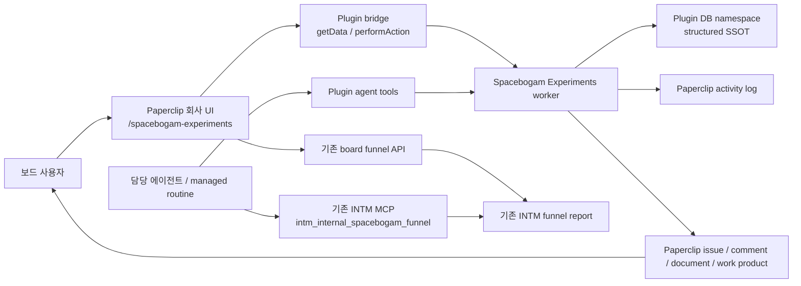

# 공간보감 실험 운영 페이지 — Paperclip 유기적 통합 구현 계획

## 1. TL;DR

공간보감의 장기 실험 운영 기능은 Paperclip 코어에 또 하나의 전용 도메인을 직접 심지 않고, 저장소에 번들되는 1급(first-party) 플러그인 `@paperclipai/plugin-spacebogam-experiments`로 구현한다.

- 회사 경로 `/af/:companyPrefix/spacebogam-experiments`에 `실험 운영` 페이지를 노출한다.
- 기존 회사 선택, 보드 인증, 에이전트 키, 플러그인 DB namespace, 활동 로그, 이슈·문서·work product, routine, UI slot을 그대로 사용한다.
- 기존 `/af/:companyPrefix/analytics/funnel`과 INTM `intm_internal_spacebogam_funnel`을 측정 기준으로 유지하고 계산식·자격 증명·원시 이벤트를 복제하지 않는다.
- 구조화된 실험·그룹·리드 결과·스냅샷·관찰은 플러그인 DB가 단일 기준이다.
- 각 실험은 기존 Paperclip 이슈에 연결한다. 에이전트의 전략은 이슈 댓글/work product/의사결정 상호작용으로 검토하며, 에이전트가 실험 상태나 결과를 직접 바꾸지 못하게 서버에서 차단한다.
- v1은 회사당 동시에 실행 중인 실험을 하나로 제한한다.
- CMP 회사의 운영 경로는 `/af/CMP/spacebogam-experiments`다.

## 2. 사용자 결과와 완료 조건

사용자는 하나의 Paperclip 페이지에서 다음 질문에 답할 수 있어야 한다.

1. 지금 어떤 실험이 실행 중인가?
2. 대조군과 실험군의 표본과 결과는 어디까지 쌓였는가?
3. 현재 차이가 행동할 수 있을 만큼 충분한가?
4. 퍼널 데이터는 언제까지 수집됐고 신뢰 가능한가?
5. 담당 에이전트는 어떤 근거로 어떤 전략을 제안했는가?
6. 내가 승인하거나 수정해야 할 다음 결정은 무엇인가?
7. 이전 실험과 결정 기록은 어디에서 확인하는가?

완료는 다음이 모두 실제 환경에서 증명될 때다.

- `실험 운영`이 Spacebogam 회사의 Paperclip 사이드바에 보인다.
- `/af/CMP/spacebogam-experiments` 직접 진입과 새로고침이 성공한다.
- 실험 생성, 설계 수정, 시작, 일시정지, 완료, 취소, 보관과 리드 결과 입력이 실제 DB에 남는다.
- 차트와 표가 같은 집계 결과를 사용하고, 표본·신선도·판단 가능 상태를 명확히 구분한다.
- 기존 퍼널 분석 링크와 데이터 기준 시각이 함께 보인다.
- 담당 에이전트는 회사 범위의 실험 상태를 읽고 전략 제안을 남길 수 있지만 실험 상태·설계·리드 결과를 바꿀 수 없다.
- 모든 변경이 기존 활동 로그에 플러그인 출처로 남고 연결 이슈에서 제안·승인을 추적할 수 있다.
- 다른 회사의 보드 사용자·에이전트가 Spacebogam 실험 데이터에 접근하지 못한다.
- 플러그인이 비활성·오류 상태여도 기존 퍼널, 이슈, 회사 화면은 정상 동작한다.

## 3. 범위와 비범위

### 3.1 포함

- first-party 번들 플러그인 패키지와 설치·활성화·회사 readiness 경로
- 회사 사이드바, 페이지, 보조 route sidebar
- 실험·variant·entry·snapshot·observation 구조화 저장소
- board-only 수명주기·설계·결과 입력
- agent-safe 읽기·관찰·전략 제안 도구
- 기존 Paperclip 이슈, 댓글, 문서, work product, 의사결정 상호작용, routine과의 연결
- 기존 Spacebogam 퍼널/Naver 결과의 보드 표시와 에이전트 분석 연결
- Chart.js 기반 비교·추세·표본/guardrail 시각화와 접근 가능한 표
- 낙관적 동시성, 멱등성, 회사 격리, 활동 로그
- 한국어 UI, 반응형, 접근성, empty/loading/stale/error/conflict/disabled 상태
- 기존 CMP-76 운영 문서의 역사 자료 취급과 안내
- 테스트, 배포, 실제 브라우저/API 증거, 되돌림

### 3.2 제외

- 별도 웹앱, 별도 로그인, 별도 회사 선택기, 별도 에이전트 런타임
- Paperclip 코어 DB에 Spacebogam 전용 테이블 추가
- 새로운 분석 SaaS·BI·차트 의존성 도입
- 퍼널 계산식, Naver API 자격 증명, 원시 이벤트를 플러그인에 복제
- 연락처·이름·전화·이메일·IP·자유 형식 원문 저장
- 에이전트의 자동 실험 시작·중지·설계 변경·리드 결과 변경
- 에이전트 전략 제안의 자동 외부 게시나 고객 접촉
- 자유 형식 CMP-76 문서를 자동 파싱해 정규화 데이터로 확정
- v1의 동시 다중 실행 실험, 통계적 유의성 엔진, 다중 터치 어트리뷰션

## 4. 유기적 통합 원칙

이 기능은 아래 기존 경계를 통과하지 않고 확장한다.

| 관심사 | 사용할 기존 Paperclip 경계 | 새로 만들지 않을 것 |
|---|---|---|
| 화면 | 플러그인 `sidebar`, `page` slot | 중복 `routeSidebar`, 독립 SPA, 숨은 URL |
| 회사 범위 | 현재 company prefix와 `companyId` | 별도 tenant 개념 |
| 인증 | board/agent actor와 plugin bridge/scoped API | 별도 세션·토큰 |
| 저장 | host가 관리하는 plugin DB namespace | 외부 DB, core 전용 테이블 |
| 감사 | `ctx.activity.log`와 기존 활동 피드 | 별도 감사 로그 화면 |
| 작업·승인 | 기존 issue/comment/document/work product/interaction | 전용 승인 시스템 |
| 자동화 | 기존 managed routine | 별도 cron 서버 |
| 퍼널 수치 | 기존 Paperclip board API와 INTM MCP | 계산 복제 |
| UI | 기존 design token과 Chart.js registry 패턴 | 신규 UI kit·차트 패키지 |

핵심 참조:

- 플러그인 계약: `doc/plugins/PLUGIN_SPEC.md`, `packages/plugins/sdk/README.md`
- 구현 예제: `packages/plugins/plugin-llm-wiki/src/manifest.ts`, `src/worker.ts`, `src/ui/*`, `migrations/*`, `tests/*`
- 번들 검색: `server/src/routes/plugins.ts`
- 브리지: `ui/src/plugins/bridge.ts`, `ui/src/api/plugins.ts`
- 퍼널: `server/src/routes/spacebogam-funnel.ts`, `ui/src/hooks/useSpacebogamFunnel.ts`
- 활동 로그: `server/src/services/activity-log.ts`, `packages/plugins/sdk/src/types.ts`
- 이슈 도메인: `server/src/services/issues.ts`, `documents.ts`, `work-products.ts`, `issue-references.ts`

## 5. 확정 아키텍처



### 5.1 패키지

신규 패키지:

```text
packages/plugins/plugin-spacebogam-experiments/
  package.json
  tsconfig.json
  esbuild.config.mjs
  rollup.config.mjs
  migrations/
    001_spacebogam_experiments.sql
  src/
    manifest.ts
    worker.ts
    contracts.ts
    repository.ts
    service.ts
    issue-integration.ts
    tools.ts
    ui/
      index.tsx
      app.tsx
      api.ts
      charts.tsx
      forms.tsx
      states.tsx
  tests/
    plugin.spec.ts
    repository.spec.ts
    worker.spec.ts
    tools.spec.ts
    ui.spec.tsx
    screenshots/
```

큰 파일이 250 순수 LOC를 넘기기 전에 도메인별로 분리한다. `plugin-llm-wiki`의 구조를 복사하되 wiki 전용 추상화는 가져오지 않는다.

### 5.2 노출

manifest UI slot:

- `sidebar`: 표시명 `전체 현황`, 기존 회사 사이드바의 안정적인 order
- `page`: `routePath: "spacebogam-experiments"`
- 퍼널 분석과 의사결정은 기존 회사 메뉴를 SSOT로 사용하며 별도 `routeSidebar`를 만들지 않음

plugin `routePath`는 단일 slug 제약을 따른다. `/analytics/experiments`를 억지로 만들기 위한 core route shim은 추가하지 않는다.

Spacebogam 회사에서 plugin readiness가 충족된 경우 최종 경로:

```text
/af/CMP/spacebogam-experiments
```

### 5.3 번들·설치·회사 readiness

- `server/src/routes/plugins.ts`의 번들 allowlist에 `@paperclipai/plugin-spacebogam-experiments`를 추가한다.
- workspace/lockfile/package build graph에 패키지를 연결한다.
- 설치는 인스턴스 범위, 데이터와 설정은 회사 범위라는 기존 plugin contract를 유지한다.
- 설치 후 기본적으로 모든 회사에 메뉴를 보이지 않는다.
- plugin company settings에 `enabledCompanyIds` 같은 임의 목록을 만들지 않는다. 기존 회사 범위 plugin 설정/ready 상태를 사용한다.
- Spacebogam 회사에서 `enabled=true`, 책임 에이전트·기본 연결 프로젝트/이슈를 설정하면 sidebar slot이 나타난다.
- 준비되지 않은 직접 URL은 404처럼 숨기지 않고, 보드 사용자에게 기존 plugin readiness 화면으로 연결되는 설명 상태를 보여준다.
- 배포 절차에 번들 패키지 빌드 후 설치/활성화/회사 설정을 한 번 수행하는 단계와 검증 API를 포함한다.

## 6. 구조화 데이터 계약

플러그인 DB namespace 내부의 모든 테이블은 `company_id`를 포함한다. UUID와 참조키는 회사 범위를 포함한 unique/foreign-key 또는 서비스 검증으로 교차 회사 연결을 차단한다.

### 6.1 `experiments`

| 필드 | 규칙 |
|---|---|
| `id` | UUID PK |
| `company_id` | UUID, 필수 |
| `title` | 1~120자 |
| `hypothesis` | 1~2000자 |
| `status` | `draft`, `running`, `paused`, `completed`, `cancelled` |
| `primary_metric` | v1은 `won_rate` 고정; 향후 호환을 위해 컬럼 유지 |
| `guardrail_metric` | nullable enum: `disqualification_rate`, `pending_staleness` |
| `minimum_sample_per_variant` | 기본 30, 1~100000 |
| `target_lift` | nullable decimal; UI에서는 % |
| `planned_start_at` | nullable timestamptz |
| `started_at` | nullable timestamptz |
| `ended_at` | nullable timestamptz |
| `linked_issue_id` | nullable core issue UUID |
| `responsible_agent_id` | nullable core agent UUID |
| `version` | integer, 기본 1 |
| `archived_at` | nullable timestamptz |
| `created_by_type/id` | board/plugin actor provenance |
| `updated_by_type/id` | board/plugin actor provenance |
| `created_at/updated_at` | timestamptz |

제약:

- `(company_id, id)` unique
- `(company_id, linked_issue_id)` index
- `(company_id, status, started_at desc)` index
- 회사당 `status='running' AND archived_at IS NULL`인 행은 최대 하나
- `completed/cancelled`에는 `ended_at` 필수
- `running`에는 variant 2개 이상, control 정확히 1개
- `archived_at`은 수명주기 상태가 아니다.

### 6.2 `experiment_variants`

| 필드 | 규칙 |
|---|---|
| `id` | UUID PK |
| `company_id`, `experiment_id` | 필수 |
| `key` | 안정 키, 예: `control`, `variant-a` |
| `name` | 1~80자 |
| `description` | 0~1000자 |
| `is_control` | boolean |
| `sort_order` | integer |
| `created_at/updated_at` | timestamptz |

제약:

- `(company_id, experiment_id, key)` unique
- 실험 시작 후 key와 control 지정은 변경 불가
- running 이후 이름/설명 변경은 board 승인 interaction과 새 version을 요구

### 6.3 `experiment_entries`

직접 입력하는 리드는 개인정보가 아닌 실험 단위 사건이다.

| 필드 | 규칙 |
|---|---|
| `id` | UUID PK |
| `company_id`, `experiment_id`, `variant_id` | 필수 |
| `lead_key_hash` | 인증된 UI 요청의 일회성 `leadKey`를 서버가 정규화·HMAC한 비식별 키 |
| `outcome` | `pending`, `won`, `lost`, `disqualified` |
| `utm_source/medium/campaign` | nullable, 길이 제한·정규화 |
| `entered_at` | 필수 |
| `outcome_at` | pending이면 null, 나머지는 필수 |
| `version` | integer |
| `created_by/updated_by` | actor provenance |
| `created_at/updated_at` | timestamptz |

제약:

- `(company_id, experiment_id, lead_key_hash)` unique
- 이름·전화·이메일·IP·메모 원문 필드 금지
- raw `leadKey`는 TLS로 보호된 authenticated request body에만 존재할 수 있다. 서버는 길이·형식을 검증한 뒤 즉시 HMAC하고 원문을 DB, activity, error, request log, evidence에 남기지 않는다.
- variant는 같은 회사·실험 소속이어야 한다.
- completed/cancelled/archived 실험의 entry 변경 금지

### 6.4 `experiment_snapshots`

판단 당시의 집계·퍼널 근거를 재현하는 immutable projection이다.

| 필드 | 규칙 |
|---|---|
| `id` | UUID PK |
| `company_id`, `experiment_id` | 필수 |
| `recorded_at` | 필수 |
| `variant_metrics_json` | variant별 sample/outcome/conversion |
| `delta_json` | control 대비 절대/상대 차이 |
| `guardrail_json` | nullable |
| `funnel_generated_at/data_through` | nullable |
| `funnel_quality_status` | nullable |
| `funnel_report_hash` | nullable |
| `source` | `manual`, `board_refresh`, `agent_observation`, `lifecycle` |
| `actor_type/id` | provenance |

원시 funnel payload, UTM 전체 목록, credential은 저장하지 않는다.

### 6.5 `experiment_observations`

에이전트와 보드 사용자의 근거 기록은 append-only다.

| 필드 | 규칙 |
|---|---|
| `id` | UUID PK |
| `company_id`, `experiment_id` | 필수 |
| `kind` | `note`, `measurement`, `strategy_proposal`, `decision_result` |
| `summary` | 1~4000자 |
| `evidence_json` | 허용된 집계와 링크만 |
| `funnel_generated_at/report_hash` | nullable |
| `issue_comment_id` | nullable |
| `work_product_id` | nullable |
| `idempotency_key` | nullable |
| `actor_type/id`, `created_at` | provenance |

제약:

- update/delete API를 제공하지 않는다.
- `(company_id, experiment_id, idempotency_key)` partial unique
- strategy proposal은 연결 issue와 생성 결과를 함께 기록한다.

## 7. 집계와 판단 규칙

### 7.1 실험 집계

동일 entry projection에서 차트와 표를 만든다.

- `sample`: variant별 전체 entry
- `resolved`: `won|lost`
- v1 `primary successes = won`
- `eligible denominator = won + lost`
- `wonRate = won / eligible denominator`
- `absoluteDelta = treatmentRate - controlRate`
- `relativeLift = controlRate > 0 ? absoluteDelta / controlRate : null`

`pending`과 `disqualified`는 sample 품질 표에는 보이되 계약 전환 분모에서 제외한다. 정확한 denominator, pending, 제외 수를 표에서 함께 표시한다. 퍼널의 방문→리드 전환은 기존 funnel report에만 표시하며 실험 entry의 계약 전환률과 합치지 않는다.

### 7.2 verdict readiness

v1은 통계적 유의성을 주장하지 않는다.

- variant 하나라도 `sample < minimumSamplePerVariant`: `표본 수집 중`
- funnel quality가 `stale|invalid_sequence|empty`: `측정 확인 필요`
- 실험 entry 갱신 시각이 7일 초과: `실험 기록 오래됨`
- 최소 표본 충족 + funnel `ready`: `방향성 검토 가능`
- completed: `결과 기록됨`

UI 문구는 `승자 확정`이 아니라 `방향성 검토 가능`을 사용한다.

### 7.3 두 개의 신선도

다음 두 시각을 합치지 않는다.

- `실험 기록 갱신`: plugin SSOT의 최신 entry/observation/snapshot
- `퍼널 데이터 기준`: 기존 funnel report의 `dataThrough`와 `generatedAt`

기존 `useSpacebogamFunnel`의 60초 stale, 5분 refetch를 유지한다. plugin overview는 mutation 성공 시 즉시 invalidate하고, 열린 페이지에서 5분마다 refetch한다.

퍼널 API가 disabled/timeout/error여도 수동 실험 기록·과거 실험은 계속 사용할 수 있다. 단, funnel 근거가 필요한 verdict/전략에는 경고를 붙인다.

## 8. 권한·API·도구 계약

### 8.1 권한 행렬

| 기능 | 보드 사용자 | 같은 회사 에이전트 | 다른 회사/익명 |
|---|---:|---:|---:|
| overview/list/detail | 허용 | 도구/API로 허용 | 거부 |
| create/edit design | 허용 | 거부 | 거부 |
| start/pause/complete/cancel/archive | 허용 | 거부 | 거부 |
| entry create/update/delete | 허용 | 거부 | 거부 |
| snapshot 생성 | 허용 | observation 과정의 append만 | 거부 |
| observation append | 허용 | 허용 | 거부 |
| strategy proposal | 허용 | 허용 | 거부 |
| responsible agent 설정 | 허용 | 거부 | 거부 |
| managed routine 설정/실행 | 허용 | 선언된 routine 실행만 | 거부 |

권한은 프롬프트가 아니라 manifest auth와 worker action/tool handler에서 강제한다.

### 8.2 UI bridge data

등록:

- `overview`: running/current, history summary, readiness, settings readiness
- `experiment`: experiment + variants + aggregate + recent observations
- `entries`: cursor pagination, filter, accessible table
- `history`: completed/cancelled/archived experiments
- `settings`: responsible agent, linked project/issue defaults, routine status

UI bridge는 board session과 현재 회사 범위를 사용한다.

### 8.3 board-only actions

- `create-experiment`
- `update-experiment`
- `replace-draft-variants`
- `start-experiment`
- `pause-experiment`
- `complete-experiment`
- `cancel-experiment`
- `archive-experiment`
- `create-entry`
- `update-entry`
- `delete-entry`
- `link-issue`
- `select-responsible-agent`
- `request-strategy`
- `reconcile-managed-routine`

모든 action input은 strict schema로 검증하고 `companyId`, `version`, 필요한 경우 `idempotencyKey`를 요구한다.

### 8.4 scoped API

에이전트용 JSON 경로는 manifest `apiRoutes`에 선언한다.

| method/path | auth | 목적 |
|---|---|---|
| `GET /overview?companyId=` | `board-or-agent` | 최소 상태 |
| `GET /experiments/:experimentId?companyId=` | `board-or-agent` | 상세·집계 |
| `POST /experiments/:experimentId/observations` | `board-or-agent` | append-only 관찰 |
| `POST /experiments/:experimentId/strategy-proposals` | `board-or-agent` | 연결 이슈/work product 제안 |

수명주기·설계·entry mutation은 scoped agent API에 넣지 않고 board bridge action으로만 제공한다.

### 8.5 agent tools

manifest에 다음 도구를 등록한다.

1. `spacebogam_experiments_overview`
   - 입력: `companyId`
   - 출력: 현재 실험, readiness, 표본 집계, 신선도, 연결 issue
2. `spacebogam_experiment_get`
   - 입력: `companyId`, `experimentId`
   - 출력: 설계, variant 집계, 최근 snapshot/observation
3. `spacebogam_experiment_record_observation`
   - 입력: `companyId`, `experimentId`, `summary`, 허용된 evidence, `idempotencyKey`
   - 효과: observation append + snapshot + activity
4. `spacebogam_experiment_propose_strategy`
   - 입력: `companyId`, `experimentId`, `proposal`, evidence, `idempotencyKey`
   - 효과: observation append + 연결 issue comment/work product + 필요한 decision interaction

모든 도구:

- 호출 에이전트의 회사가 input 회사와 일치하는지 확인한다.
- 구조화 집계만 반환하고 PII와 raw funnel payload를 반환하지 않는다.
- responsible agent가 설정됐을 때 전략 제안 도구는 해당 에이전트 또는 명시적 routine actor만 허용한다.
- 실행 결과에 experiment/issue/work product 링크를 반환한다.

### 8.6 낙관적 동시성과 멱등성

- mutable experiment/entry action은 `version`을 요구한다.
- transaction에서 `WHERE id=? AND company_id=? AND version=?`로 갱신한다.
- 실패 시 409과 `latest` projection, 변경 필드 요약을 반환한다.
- UI는 입력을 버리지 않고 최신 데이터를 다시 읽은 뒤 `다시 적용`을 제공한다.
- create, observation, proposal은 회사 범위 idempotency key unique로 중복 생성을 막는다.
- start transaction은 running partial unique/advisory lock을 통해 두 실행 실험을 막고 409 `running_experiment_exists`를 반환한다.

## 9. 이슈·문서·work product·승인 통합

### 9.1 실험과 이슈

- 실험 생성 시 사용자가 기존 issue를 선택하거나 `실험: {title}` 이슈를 생성한다.
- 새 이슈는 기존 company/project/assignee 규칙을 사용한다.
- plugin row에는 core issue UUID만 저장하고 serial `CMP-76`은 저장하지 않는다.
- 이슈 본문/문서는 실험 요약과 SSOT 링크를 포함하지만 canonical data는 아니다.

### 9.2 전략 제안

`전략 요청` 흐름:

1. board 사용자가 현재 실험 페이지에서 요청한다.
2. 기존 책임 에이전트와 연결 issue를 확인한다.
3. plugin overview를 읽고, 에이전트는 기존 INTM MCP로 같은 기간 funnel report를 읽는다.
4. 제안은 `spacebogam_experiment_propose_strategy`로 제출한다.
5. plugin은 append-only observation, issue comment, provenance가 있는 work product를 만든다.
6. 실험 설계·상태 변경이 포함되면 기존 request confirmation/decision interaction을 생성한다.
7. board 승인 후에만 별도 board action이 상태를 바꾼다.

에이전트 제안 자체가 상태 mutation을 수행하지 않는다.

### 9.3 managed routine

- plugin manifest의 managed routine 선언 패턴을 사용한다.
- 기본은 비활성이다.
- 보드 사용자가 책임 에이전트와 schedule을 확인하고 활성화한다.
- concurrency는 `coalesce_if_active`, missed run은 `skip_missed`.
- routine은 최신 상태를 읽고 관찰/제안만 남긴다.
- 실패는 기존 routine/run/activity 표면에서 보이고 실험 데이터는 손상되지 않는다.

### 9.4 CMP-76

- CMP-76은 배포 환경에서 runtime serial로 해석되는 기존 역사 자료다.
- source code에 serial이나 UUID를 하드코딩하지 않는다.
- plugin 설정/초기화 시 `legacyIssueId`를 선택적으로 연결한다.
- 페이지에 `기존 운영 문서 보기` 배너와 링크를 제공한다.
- 자유 형식 내용은 자동 정규화하지 않는다.
- 필요한 경우 한 번의 `legacy_source_linked` observation/work product만 기록한다.

## 10. UI 설계

### 10.1 정보 계층

한 페이지에서 다음 순서로 읽힌다.

1. 페이지 제목, 실험 상태, `퍼널 분석 보기`, `전략 요청`
2. action-required strip
   - 표본 부족, stale funnel, 기록 지연, 승인 대기, conflict
3. KPI strip
   - variant별 sample, primary conversion, control 대비 delta, 최소 표본 진행률
4. `현재 판단`
   - readiness, 근거 시각, 다음 안전한 행동
5. 차트 3개
6. variant 비교 접근 가능 표
7. entry 입력/목록
8. 최근 관찰·전략 제안과 연결 issue
9. 과거 실험

카드 안에 카드가 반복되는 구조를 피하고 section, separator, table을 사용한다.

### 10.2 Chart.js

기존 `ui/src/components/spacebogam-funnel/chartRegistry.ts`의 명시적 registry와 token 패턴을 참조한다. 새 패키지는 추가하지 않는다.

1. `그룹 계약 전환 비교`
   - bar chart
   - sample과 conversion을 tooltip/표에 함께 제공
2. `누적 전환 추세`
   - line chart
   - control/treatment의 날짜별 누적 sample과 conversion
   - 데이터가 없는 날짜는 끊김/표기로 구분
3. `표본·guardrail 진행`
   - horizontal bar 또는 mixed chart
   - 최소 표본선, 현재 진행률, guardrail 상태

모든 차트:

- 동일 projection으로 만든 인접 표가 있다.
- canvas에 접근 가능한 이름과 요약을 제공한다.
- 색만으로 control/treatment/status를 구분하지 않는다.
- stable dataset id를 사용한다.
- 좁은 화면은 높이와 범례 위치를 조정하고 가로 overflow 표를 제공한다.
- animation 감소 설정을 존중한다.

### 10.3 입력

- 실험 draft 편집과 entry 입력은 페이지 안의 form 또는 우측 drawer를 사용한다.
- 기본 행동을 modal 연쇄로 만들지 않는다.
- destructive action은 기존 confirmation 패턴을 사용한다.
- entry form은 `식별 키`, `그룹`, `결과`, UTM 선택값, 시각만 받는다.
- 식별 키는 저장될 hash임을 안내하고 연락처 입력 금지를 명시한다.
- inline edit는 저장 전 version과 변경 요약을 보여준다.

### 10.4 상태 행렬

| 상태 | 사용자에게 보이는 것 | 가능한 행동 |
|---|---|---|
| plugin not ready | 이유와 설정 링크 | 설정 |
| no experiment | empty state, 3단계 시작 안내 | draft 생성 |
| draft | 설계·variant·연결 issue | 편집, 시작 |
| running | KPI, charts, entry, strategy | 기록, 일시정지, 전략 요청 |
| paused | 정지 이유와 마지막 지표 | 재시작, 완료/취소 |
| completed/cancelled | 결과 snapshot, decision link | 보관, 복제 |
| funnel collecting/stale/error | 실험 기록 유지 + funnel 경고 | 수동 기록, 퍼널 보기 |
| worker unavailable | read-only cached/오류 상태 | 재시도, plugin status |
| schema invalid | 안전한 오류와 request id | 재시도 |
| 409 conflict | 최신 변경 요약 + 사용자의 미저장 값 | 최신화, 다시 적용 |
| approval pending | interaction/issue 링크 | 의사결정으로 이동 |

### 10.5 토큰·한국어·접근성

- `DESIGN.md`와 기존 semantic token만 사용한다.
- `pnpm check:token-gates`를 필수 gate로 둔다.
- manifest displayName은 `실험 운영`으로 두고, host 영문 key가 필요한 곳은 `ui/src/i18n/korean-menu.ts` 패턴을 따른다.
- WCAG 2.2 AA: keyboard, focus, labels, error association, contrast, chart alternative, 44px 대상, reduced motion을 검증한다.

## 11. 데이터 보안과 개인정보

- entry의 식별 키는 서버에서 정규화 후 instance/plugin secret 기반 HMAC으로 변환한다.
- hash secret은 plugin secret reference로 읽고 DB·로그·snapshot에 저장하지 않는다.
- UI와 에이전트 응답에는 hash 전체가 아닌 짧은 display token만 보인다.
- 원시 funnel, Naver credential, upstream URL/token을 plugin에 전달하지 않는다.
- 로그와 activity metadata는 secret, raw lead key, 자유 형식 PII를 제외한다.
- 모든 repository query는 company predicate를 요구한다.
- core table 읽기는 manifest `coreReadTables` 최소 목록으로 제한한다.
- plugin DB runtime write는 namespace 밖에서 실패해야 한다.
- strategy/work product도 집계·링크만 포함하고 entry 식별값을 포함하지 않는다.

## 12. 실패·비활성·삭제 정책

- plugin worker 실패: core 앱, 퍼널, 이슈는 계속 동작하고 plugin page는 재시도/status 링크를 보인다.
- migration 실패: plugin 활성화를 중단하고 기존 데이터에 write하지 않는다.
- disable: sidebar/page/tool/routine 실행을 중단하되 namespace 데이터를 보존한다.
- uninstall: 기존 plugin 계약의 data retention 경고를 표시하고 자동 drop하지 않는다.
- re-enable/upgrade: checksum migration과 schema version을 확인한 뒤 재개한다.
- rollback: 새 package/allowlist를 이전 버전으로 되돌려도 namespace는 보존한다. down migration으로 운영 데이터를 삭제하지 않는다.
- 기존 funnel error는 experiment manual record를 막지 않는다.

## 13. 구현 순서

각 단계는 characterization → RED → GREEN → targeted verification → evidence 순서다. 독립 단계만 병렬화한다.

### T01. 현재 plugin/funnel/issue 계약 고정

변경:

- 생산 코드 없음
- 기존 plugin UI contribution, bridge auth, DB namespace, activity, issue/work product, funnel refresh 계약을 characterization test로 고정

테스트:

- `server/src/__tests__/plugin-routes-authz.test.ts`
- `server/src/__tests__/plugin-database.test.ts`
- `packages/plugins/plugin-llm-wiki/tests/plugin.spec.ts`
- `ui/src/api/spacebogam-funnel.test.ts`
- `ui/src/hooks/useSpacebogamFunnel.test.ts`

완료:

- board/agent 경계와 plugin disable 동작이 문서·테스트 증거로 고정됨

### T02. 공유 실험 계약

변경:

- 최소 실행 가능한 plugin package skeleton: `package.json`, `tsconfig.json`, `vitest.config.ts`
- plugin package의 `src/contracts.ts`
- strict schemas: lifecycle, experiment, variant, entry, snapshot, observation, projection, errors, tool inputs/outputs

RED:

- 잘못된 status 전이, PII 필드, 다른 실험 variant, invalid version, unknown key 거부

GREEN:

- schema와 pure aggregation/readiness 함수 구현

검증:

```bash
pnpm --filter @paperclipai/plugin-spacebogam-experiments test
pnpm --filter @paperclipai/plugin-spacebogam-experiments typecheck
```

### T03. namespace migration과 repository

변경:

- `migrations/001_spacebogam_experiments.sql`
- `src/repository.ts`

RED:

- 회사 격리, one-running 제약, entry unique, observation idempotency, immutable snapshot, version conflict

GREEN:

- schema/index/check constraint와 transaction repository

검증:

- plugin migration checksum/restriction test
- two-company fixture
- concurrent start test
- 409 latest projection fixture

### T04. manifest, package build, 번들 검색

변경:

- `esbuild.config.mjs`, `rollup.config.mjs`와 manifest/worker/UI entry build files
- `src/manifest.ts`
- `server/src/routes/plugins.ts` 번들 allowlist
- workspace/lockfile의 정상 생성 변경

manifest:

- capabilities 최소 선언
- DB namespace + 필요한 core read tables
- sidebar/page
- scoped APIs
- 4개 tools
- optional managed routine

RED:

- bundle list에 없음, reserved route 거부, capability 누락

GREEN:

- built entrypoints와 manifest validation 통과

검증:

- bundled plugin discovery test
- manifest validator test
- package build

### T05. service와 board actions

변경:

- `src/service.ts`, `src/worker.ts`

RED:

- invalid transition
- running 중 variant key 변경
- 두 running 실험
- stale version
- duplicate idempotency
- agent actor의 board-only action

GREEN:

- lifecycle state machine, versioned writes, entry CRUD, snapshots, mutation invalidation projection

모든 성공 mutation:

- `ctx.activity.log`
- experiment/issue link
- 안전한 metadata

### T06. issue/work product/decision 통합

변경:

- `src/issue-integration.ts`

RED:

- 실험 생성 이슈 중복
- 다른 회사 issue 연결
- strategy proposal 중복
- governed change가 approval 없이 적용되는 경우

GREEN:

- 기존 issue 선택/생성
- comment/work product 생성
- decision interaction 생성
- link/backlink

이 단계에서 bespoke recommendation/approval table은 만들지 않는다.

### T07. agent tools와 routine

변경:

- `src/tools.ts`, manifest tool/routine 선언, worker registrations

RED:

- cross-company agent
- 책임 에이전트가 아닌 proposal
- PII 포함 evidence
- lifecycle mutation 시도
- repeated idempotency

GREEN:

- 2 read + observation + proposal 도구
- 기존 INTM MCP 사용을 안내하는 managed routine prompt
- activity/work product provenance

검증:

- board/agent actor matrix
- 실제 agent API key로 read/propose smoke
- agent가 start/update/entry action을 호출할 수 없음을 증명

### T08. UI data layer와 상태

변경:

- `src/ui/api.ts`, `states.tsx`

RED:

- plugin not ready, no experiment, stale funnel, worker error, invalid response, conflict
- mutation 후 cache invalidation
- 5분 refetch

GREEN:

- bridge queries/actions
- 기존 `useSpacebogamFunnel`
- error normalization과 conflict recovery

### T09. 페이지·기존 sidebar navigation

변경:

- `src/ui/index.tsx`, `app.tsx`
- manifest slot exports

RED:

- contribution page/sidebar가 없고 직접 reload 실패

GREEN:

- summary-first page
- 기존 회사 sidebar의 `전체 현황` 링크
- 퍼널 분석·의사결정 기존 메뉴와 page 내부 backlink
- readiness/configuration state

검증:

- `server/src/__tests__/plugin-routes-authz.test.ts`
- UI contribution tests
- `/af/CMP/spacebogam-experiments` direct reload
- 회사 switch에서 다른 회사 데이터가 남지 않음

### T10. Chart.js와 접근 가능한 표

변경:

- `src/ui/charts.tsx`

RED:

- registry, stable datasets, no-data, reduced-motion, table parity

GREEN:

- comparison bar
- cumulative line
- sample/guardrail chart
- 인접 표와 요약

검증:

- unit tests
- Storybook/screenshot fixtures: empty, collecting, ready, stale, conflict, mobile
- keyboard/screen-reader label 확인

### T11. forms와 board governance

변경:

- `src/ui/forms.tsx`

RED:

- PII-looking input 경고
- invalid transition
- destructive confirmation
- 409 reapply
- agent-generated approval pending

GREEN:

- draft/variant form
- entry drawer
- lifecycle controls
- strategy request
- approval/issue links

### T12. CMP-76 역사 링크와 초기 설정

변경:

- plugin company settings/readiness
- legacy source link action

RED:

- hardcoded CMP-76 source 문자열 검사
- cross-company issue
- free-text auto-import

GREEN:

- runtime issue 선택
- history banner
- one-time append-only legacy observation

### T13. Hermes Telegram 의사결정 브리지

목표:

- Paperclip 의사결정 항목을 Hermes가 이미 운영하는 Telegram 채널로 전달한다.
- 사용자가 결정 근거를 함께 확인하고 Telegram에서 승인·반려할 수 있게 한다.
- 웹과 Telegram이 같은 Paperclip interaction/approval 상태를 사용한다.

변경:

- 기존 inbox/decision 읽기와 board-only interaction resolve API를 재사용한다.
- 필요할 때만 company-scoped read-only `decision package` projection을 추가한다.
- Hermes에는 전달과 엄격한 명령 해석만 담당하는 최소 adapter/skill을 둔다.
- Hermes의 기존 `TELEGRAM_BOT_TOKEN`, `TELEGRAM_ALLOWED_USERS`, `TELEGRAM_HOME_CHANNEL`은 실행 환경에서만 읽고 Paperclip 저장소·DB·로그로 복사하지 않는다.

결정 패키지:

- company/issue/interaction ID와 현재 revision
- 제목, 결정 이유, 선택지
- 결정에 필요한 KPI·표본·신선도·수집 기준 시각
- evidence/document/work product/issue/Paperclip 직접 링크
- 만료 시각, 현재 상태, 충돌 여부
- secret, raw lead, 연락처, 전체 첨부 원문은 제외

보안·정합성:

- 장기 접근은 Telegram sender allowlist로 제한한다.
- Telegram sender를 활성 Paperclip board user에 명시적으로 매핑한다.
- agent token으로 사람의 결정을 대신하지 않는다.
- `decision-id + expected-revision + approve|reject + optional-note` 형태의 엄격한 명령 또는 서명된 callback만 허용하고 LLM 자연어 추론으로 상태를 바꾸지 않는다.
- stale/expired/replay/cross-company/unregistered sender는 fail closed 한다.
- 재시도는 멱등이고 결과는 기존 activity log와 interaction result에 남긴다.

RED:

- allowlist 밖 sender가 결정을 조회·변경
- evidence 없는 알림 또는 secret/PII 포함
- stale revision, 만료, 중복 callback, 다른 회사 interaction 승인
- Telegram 승인과 웹 상태가 서로 달라짐
- 자유 형식 자연어를 승인 명령으로 오인

GREEN:

- Hermes 채널에 안전한 결정 패키지와 Paperclip 직접 링크 전달
- allowlisted sender의 엄격한 승인·반려를 기존 board-only resolve 경계로 실행
- 웹, Telegram 응답, interaction, activity가 같은 최종 상태·actor를 표시
- stale/duplicate/unauthorized 요청은 변경 없이 설명 가능한 오류 반환

검증:

- Telegram adapter 계약 unit test
- board actor mapping과 회사/권한/revision/idempotency integration test
- 토큰·채널 ID·raw evidence가 로그/응답/fixture에 없는지 정적 검사
- 실제 Hermes 채널에서 수신 → 승인/반려 → 웹/API/activity 동일 상태 확인

### T02~T13 단계별 증명 행렬

각 task는 아래 명령을 해당 task의 RED와 GREEN에서 같은 형태로 실행한다. RED는 의도한 assertion 하나 이상이 실패해야 하고, GREEN은 명시된 기대 결과를 만족해야 한다. 실제 명령 출력은 task별 evidence log에 저장한다.

| Task | 명령/단계 | GREEN 기대 결과 |
|---|---|---|
| T02 | `pnpm --filter @paperclipai/plugin-spacebogam-experiments exec vitest run tests/contracts.spec.ts` → `pnpm --filter @paperclipai/plugin-spacebogam-experiments typecheck` | strict schema와 pure 집계 테스트 전부 통과, PII/unknown key 거부 |
| T03 | `pnpm --filter @paperclipai/plugin-spacebogam-experiments exec vitest run tests/repository.spec.ts` | 두 회사 fixture 격리, running unique, immutable snapshot, version 409, idempotency 통과 |
| T04 | `pnpm --filter @paperclipai/plugin-spacebogam-experiments build` → `pnpm exec vitest run server/src/__tests__/plugin-routes-authz.test.ts server/src/__tests__/plugin-database.test.ts` | entrypoints 생성, manifest/capability/namespace 검증, bundled discovery에 신규 package 1회 노출 |
| T05 | `pnpm --filter @paperclipai/plugin-spacebogam-experiments exec vitest run tests/worker.spec.ts tests/service.spec.ts` | actor matrix와 lifecycle transition, snapshot/activity side effect, duplicate/concurrent 요청 통과 |
| T06 | `pnpm --filter @paperclipai/plugin-spacebogam-experiments exec vitest run tests/issue-integration.spec.ts` | 같은 회사 issue만 연결, proposal 중복 없음, governed change는 pending interaction만 만들고 상태 불변 |
| T07 | `pnpm --filter @paperclipai/plugin-spacebogam-experiments exec vitest run tests/tools.spec.ts tests/routine.spec.ts` | 책임 에이전트 read/propose 성공, 다른 회사·비책임 agent proposal·lifecycle mutation 거부, PII 미노출 |
| T08 | `pnpm --filter @paperclipai/plugin-spacebogam-experiments exec vitest run tests/ui-data.spec.tsx` | ready/empty/stale/error/409 projection, mutation invalidate, 5분 refetch를 fake timer로 증명 |
| T09 | `pnpm --filter @paperclipai/plugin-spacebogam-experiments exec vitest run tests/ui-navigation.spec.tsx` → `pnpm exec playwright test tests/e2e/spacebogam-experiment-operations.spec.ts --grep "navigation"` | 기존 sidebar의 전체 현황 1개, routeSidebar 0개, direct reload, company switch, funnel/decision 기존 메뉴 통과 |
| T10 | `pnpm --filter @paperclipai/plugin-spacebogam-experiments exec vitest run tests/charts.spec.tsx` → `pnpm test:storybook-visual -- --grep "Spacebogam experiments"` | chart/table 수치 parity, stable dataset, empty/stale/mobile/reduced-motion screenshot 통과 |
| T11 | `pnpm --filter @paperclipai/plugin-spacebogam-experiments exec vitest run tests/forms.spec.tsx` → `pnpm exec playwright test tests/e2e/spacebogam-experiment-operations.spec.ts --grep "governance"` | entry 저장, raw key 미영속, 409 재적용, destructive confirmation, approval link 통과 |
| T12 | `pnpm --filter @paperclipai/plugin-spacebogam-experiments exec vitest run tests/legacy-link.spec.ts` → `rg -n "CMP-76" packages/plugins/plugin-spacebogam-experiments server ui` | runtime-selected legacy issue만 연결하고 자동 import 없음; production source의 hardcoded `CMP-76` 검색 결과 0 |
| T13 | Paperclip interaction/actor tests → Hermes adapter tests → 실제 Telegram 수신·callback → 웹/API/activity 재조회 | allowlisted sender만 결정 근거를 받고 strict revision 승인·반려가 기존 interaction SSOT에 반영되며 secret/PII/중복 변경 없음 |

브라우저 단계에서 실패하면 Playwright trace와 현재 URL, company prefix, plugin readiness 응답을 같은 evidence 폴더에 남긴다. API/auth 단계에서 실패하면 secret을 제거한 status/code/request-id만 남긴다.

### T14. 통합 회귀

명령:

```bash
pnpm --filter @paperclipai/plugin-spacebogam-experiments test
pnpm --filter @paperclipai/plugin-spacebogam-experiments typecheck
pnpm --filter @paperclipai/plugin-spacebogam-experiments build
pnpm exec vitest run server/src/__tests__/plugin-routes-authz.test.ts server/src/__tests__/plugin-database.test.ts
pnpm exec vitest run ui/src/api/spacebogam-funnel.test.ts ui/src/hooks/useSpacebogamFunnel.test.ts
pnpm -r typecheck
pnpm test:run
pnpm check:token-gates
pnpm build
git diff --check
```

추가 검사:

- 새 production 파일 250 순수 LOC gate
- no `any`, suppression, secret/PII fixture leakage
- OpenAPI/plugin manifest output
- plugin disabled 회귀
- 기존 funnel page 회귀

### T15. 실제 환경 배포와 검증

사전:

- 현재 branch/dirty state와 다른 작업자의 변경 확인
- 실행 중 run/heartbeat와 PM2 process 확인
- 현재 `/api/health`, funnel page, plugin list snapshot
- secret 값은 출력하지 않고 설정 존재만 검증

배포:

- package build/install
- plugin hot lifecycle을 우선 사용
- server restart가 실제로 필요한 번들/host 변경에만 PM2 안전 restart
- restart 전 실행 중 작업이 있으면 drain/완료 후 진행

실브라우저/API 시나리오:

1. CMP 기존 sidebar에서 `전체 현황` 1개와 중복 route sidebar 0개 확인
2. direct reload
3. draft 생성과 DB 재조회
4. 2 variants, 하나의 control
5. 실험 시작
6. entry 입력/수정과 차트·표 일치
7. 다른 세션에서 version 충돌 → 409 → 다시 적용
8. funnel stale/disabled fixture에서도 수동 기록 유지
9. `퍼널 분석 보기` 이동과 복귀
10. 책임 에이전트 read
11. agent strategy proposal → issue comment/work product/decision
12. agent lifecycle mutation 거부
13. cross-company board/agent 거부
14. activity feed에서 모든 mutation 확인
15. pause/complete/archive와 history
16. mobile 390px와 desktop
17. plugin disable → 메뉴/tool 중단, core 정상
18. re-enable → 데이터 복구
19. allowlisted Telegram sender에게 근거·신선도·직접 링크가 포함된 decision package 수신
20. Telegram 승인·반려 → Paperclip 웹/API/interaction/activity의 actor·revision·상태 일치
21. stale/duplicate/unregistered sender 요청 거부와 토큰·채널 ID·raw evidence 미노출

### T16. 최종 ultrawork 감사

- 모든 코드·테스트·브라우저/API·배포 증거가 준비된 후 `codex-ultrawork-reviewer`에 diff, 목표, 시나리오 증거를 전달한다.
- FAIL이면 지적별 최소 수정 후 T14~T16을 반복한다.
- PASS 전에는 완료로 보고하지 않는다.

## 14. 테스트 데이터

고정 fixture:

- company A `CMP`, company B `OTHER`
- control/treatment
- empty, sample 29/30, ready 30/30
- control 10%, treatment 13%
- control zero denominator
- disqualified entries
- stale experiment records
- funnel `ready`, `collecting`, `stale`, `invalid_sequence`, disabled, timeout
- two concurrent board sessions
- responsible agent, unrelated same-company agent, other-company agent
- duplicated idempotency key

production smoke는 실제 개인정보를 만들지 않고 `qa-{timestamp}` 식별 키를 사용한 뒤 완료 후 보관한다. 삭제보다 보관과 명시적 QA 표시를 우선한다.

## 15. 증거와 정리 영수증

구현 실행은 다음 root를 사용한다.

```text
.omo/ulw-loop/<run-id>/evidence/spacebogam-experiment-operations/
```

필수 증거:

- characterization/red/green logs
- targeted/full verification logs
- migration/schema inventory
- plugin manifest/build receipt
- API status/auth matrix
- browser screenshots desktop/mobile/state별
- persistence before/after
- agent tool read/propose 및 mutation deny
- issue/work product/decision/activity 링크
- PM2/plugin lifecycle 확인
- production health/direct reload
- reviewer PASS
- 임시 프로세스·포트·fixture·파일 정리 영수증

비밀, bearer, HMAC 원문, raw lead key는 증거에 포함하지 않는다.

## 16. 배포·되돌림

### 배포 순서

1. DB migration/package build
2. 번들 검색과 plugin install
3. Spacebogam company 활성화·설정
4. 책임 에이전트와 연결 project/issue 선택
5. routine은 비활성 상태로 smoke
6. UI/API/agent/live 검증
7. 사용자가 routine 주기를 확인한 뒤 활성화

### 되돌림

- UI/worker 오류 시 plugin disable
- host regression이면 bundle allowlist/package wiring revert
- namespace 데이터는 보존
- managed routine disable
- 기존 `/analytics/funnel`, issues, decisions는 영향 없이 유지
- down migration으로 실험 데이터를 삭제하지 않는다.

## 17. 명시적 거부안

### A. Paperclip 코어 sibling 도메인

거부 이유:

- Spacebogam 전용 테이블·route·tool이 core에 퍼진다.
- 이미 있는 plugin DB/UI/tool/activity/routine 확장점을 우회한다.
- 다른 회사에 필요 없는 영구 코어 유지비를 만든다.

### B. 기존 퍼널 페이지 내부 tab

거부 이유:

- 진단용 read-only 분석과 승인·수명주기가 있는 write 운영을 섞는다.
- plugin route 단일 segment 계약을 깨거나 core shim을 요구한다.
- 장기 이력·entry·agent governance가 퍼널 하위 기능처럼 축소된다.

### C. CMP-76 문서를 SSOT로 사용

거부 이유:

- versioned narrative는 row constraint, company isolation, 동시성, 집계, idempotency를 보장하지 못한다.
- 차트와 agent가 자유 형식 문서를 매번 해석해야 한다.
- 문서는 사람이 읽는 projection/history로만 유지한다.

### D. 새 recommendation/approval 테이블

거부 이유:

- 기존 issue/comment/work product/interaction 승인 흐름과 중복된다.
- 사용자가 의사결정을 확인해야 하는 위치가 분산된다.

## 18. 구현 중 지켜야 할 작업 규칙

- 현재 dirty 파일을 보존하고 충돌 파일을 임의로 되돌리지 않는다.
- 새 dependency를 추가하지 않는다.
- 한 기능은 한 SSOT를 유지한다.
- 구현 commit이 필요하면 AGENTS.md의 Lore commit protocol을 따른다.
- 외부 운영 변경, routine 활성화, destructive data 작업은 검증·승인 경계를 지킨다.
- 코드만 존재하는 상태를 완료로 부르지 않는다. 실제 CMP 페이지, API, DB, agent, issue, activity를 증명한다.

## 19. 최종 인수 체크리스트

- [ ] native plugin slot으로 메뉴와 페이지가 노출됨
- [ ] Spacebogam 회사에서만 ready/visible
- [ ] `/af/CMP/spacebogam-experiments` reload 성공
- [ ] structured SSOT와 company isolation
- [ ] 회사당 running 최대 1
- [ ] version 409와 idempotency
- [ ] PII 저장·응답·로그 없음
- [ ] funnel 계산/credential 복제 없음
- [ ] Chart.js 3종과 표 parity
- [ ] 두 신선도 시각 구분
- [ ] stale/error에서도 manual records 사용 가능
- [ ] board-only lifecycle/entry mutation
- [ ] agent read/observation/proposal만 가능
- [ ] issue/work product/decision/activity 통합
- [ ] CMP-76은 history 링크만 사용
- [ ] routine 기본 비활성·승인 후 활성
- [ ] token/accessibility/mobile 검증
- [ ] targeted/full/build/live 검증
- [ ] plugin disable/re-enable와 rollback 검증
- [ ] ultrawork reviewer PASS
- [ ] cleanup receipt
